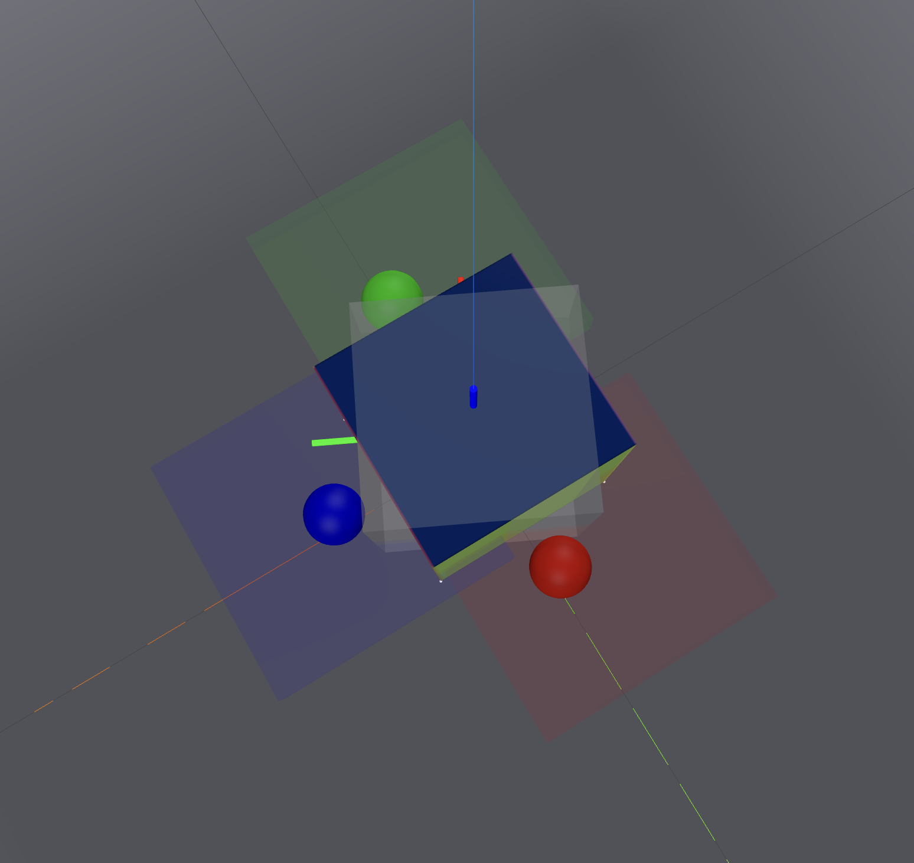
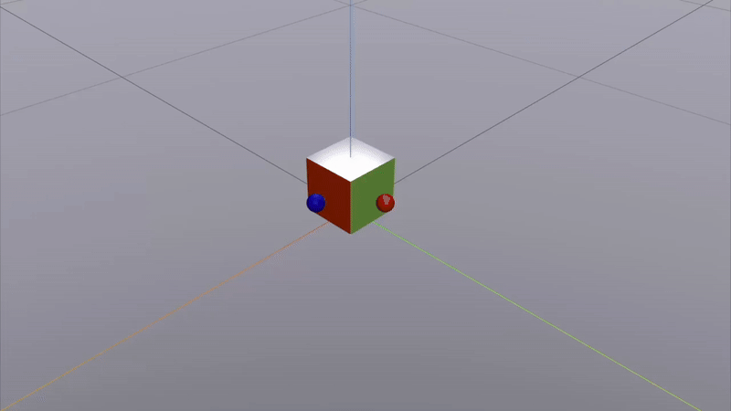

# In-place Rotation Task with TriFinger Robot

The task is to rotate the cube in place by large angles on the table using three fingers.

To simplify the problem, we approximate the three fingertips as small spheres rather than modeling the full kinematic structure. To promote a finger-gaiting pattern, we impose position limits on all three fingertips.

In the figure below, the three fingertips are represented by red, green, and blue spheres, with their corresponding position limits shown as regions in matching colors.

<!--  -->


## System state

We use [Drake](https://drake.mit.edu), a modeling and simulation toolbox for robotics, to model the system dynamics and kinematics. The system state is a 31-dimensional vector and it is structured as follows:

$$
x = [p_1, p_2, p_3, q_{\text{cube}}, p_{\text{cube}}, v_1, v_2, v_3, \omega_{\text{cube}}, v_{\text{cube}}]
$$

where:

- $p_1, p_2, p_3 \in \mathbb{R}^3$: 3D positions of fingertips 1 (red), 2 (green), and 3 (blue), respectively.  
- $q_{\text{cube}} \in \mathbb{R}^4$: Unit quaternion representing the orientation of the cube.  
- $p_{\text{cube}} \in \mathbb{R}^3$: 3D position of the cube's center of mass.  
- $v_1, v_2, v_3 \in \mathbb{R}^3$: Linear velocities of fingertips 1, 2, and 3.  
- $\omega_{\text{cube}} \in \mathbb{R}^3$: Angular velocity of the cube.  
- $v_{\text{cube}} \in \mathbb{R}^3$: Linear velocity of the cube's center of mass.


# Contact-implicit Trajectory Optimization

## Expected outcome trajectory

The trajectory shown below was generated using the `predictive sampling` method from [Mujoco MPC](https://github.com/google-deepmind/mujoco_mpc). As observed, the fingertip movements are suboptimal. We expect that contact-implicit trajectory optimization can produce higher-quality motions by reasoning more accurately about contact interactions.



## Contact Pairs

We predefine a set of potential contact pairs for trajectory optimization. In this setup, we consider 7 possible contacts: 3 between the fingertips and the cube, and 4 between the ground and the four corners of the cube's bottom face.

## Trajectory Optimization Formulation

We use the formulation from the paper `A Direct Method for Trajectory Optimization of Rigid Bodies Through Contact` by Michael Posa et al. 2013. The optimization problem can be written as

$$
\begin{equation}
\underset{\left\{h, x_0, \ldots, x_N, u_1, \ldots, u_{\star}, \lambda_1, \ldots, \lambda_N\right\}}{\operatorname{minimize}} g_f\left(x_N\right)+h \sum_{k=1}^N g\left(x_{k-1}, u_k\right)
\end{equation}
$$

This optimization problem is subject to constraints imposed by the manipulator dynamics and by rigid body contacts

The dynamics constraints are given by
$$
\begin{aligned}
q_k-q_{k+1}+h \dot{q}_{k+1} & =0 \\
H_{k+1}\left(\dot{q}_{k+1}-\dot{q}_k\right)+h\left(C_{k+1}+G_{k+1}-B_{k+1} u_{k+1}-J_{k+1}^T \lambda_{k+1}\right) & =0
\end{aligned}
$$

For a given contact point, we can write a set of contact constraints that capture stick-slip transition, stick-separation transition, and maximum dissipation.

$$
\begin{aligned}
\phi\left(q_k\right) & \geq 0 \\
\lambda_{k, z}, \lambda_{k, x}^{i},\gamma_k & \geq 0 \\
\lambda_{k, x}^i & \geq 0 \\
\phi\left(q_k\right)^T \lambda_{k, z} &= 0 \\
\mu \lambda_{k, z}-\sum_i^d \lambda_{k, x}^i & \geq 0 \\
\gamma_k+\psi\left(q_k, \dot{q}_k\right)^T D^i & \geq 0 \\
\left(\mu \lambda_{k, z}-\sum_i^d \lambda_{k, x}^i\right)^T \gamma_k & =0 \\
\left(\gamma_k+\psi\left(q_k, \dot{q}_k\right)^T D^i\right)^T \lambda_{k, x}^i & =0
\end{aligned}
$$


# Implementation

## Integration with Drake

To extend CRISP's capabilities to handle more complex problems, we integrate it with Drake's framework.

Drake offers powerful tools for collision detection, computation of signed distance functions, contact normals, and their gradients with respect to the system state and input. These features are crucial for modeling and optimizing contact-rich behaviors.

Additionally, Drake's `MathematicalProgram`, which serves similar purpose to CRISP's OptimizationProblem, provides a flexible optimization interface for defining variables, constraints, and cost functions.

We implemented new constructors for `ConstraintFunction` and `ObjectiveFunction` that interface with Drake's `Constraint` and `Cost` classes. For details, see `ConstraintFunction.h` at line 142 and `ObjectiveFunction.h` at line 93.

Furthermore, we implemented a function called `parseDrakeMathematicalProblem` within the `OptimizationProblem` class to transfer all constraints and costs defined in a `MathematicalProgram` into the `OptimizationProblem` (see `OptimizationProblem.h` at line 37).

**Note**: Drake assumes that the gradients of constraints with respect to optimization variables are dense matrices unless their sparsity patterns are explicitly specified.

### How to we verify Drake's constraints and costs are compatible with CRISP?

In the file `examples/pushbox/SolvePushboxWithDrake.cpp`, we implemented two versions of `OptimizationProblem`: one that parses Drake’s `MathematicalProgram`, and another based on the original implementation by CRISP's authors. We compare their constraints, constraint gradients/Hessians, costs, and cost gradients/Hessians. Finally, we verify that both approaches produce matching solutions.

## Code Structures

Here's an overview of the key components inside the `TriFingerRotateCube` folder:

### `assets/` Directory
- **`trifinger/`**: TriFinger robot model
  - `simplified_trifinger.urdf`: Simplified kinematic model with spherical fingertips
- **`cube/`**: Cube object model
  - `cube_v2.urdf`: Cube with contact points for ground interaction
  - Supporting files: `.obj`, `.mtl`, `.png` for visualization

### `configs/` Directory
- **`trifinger_with_cube_system_configs.yaml`**: System-level configuration including:
  - URDF file paths and package mappings
  - Contact pair definitions (7 total: 3 finger-cube + 4 cube-ground)
  - Friction coefficients for each contact pair
  - Welded links and additional joint specifications
- **`trajopt_configs.yaml`**: Optimization-specific parameters including:
  - Planning horizon and complementarity relaxation
  - Cost function weights (Q, Qf, R matrices)
  - State and input bounds
  - Default initial state configuration

### `helper_functions/` Directory
- **`drake_system_helper_functions.py`**: High-level Drake system management
  - `DrakeSystem` class: Container for all Drake components
  - `setup_drake_system()`: Factory function for creating complete simulation environment
  - Configuration validation and loading utilities
- **`drake_helper_functions.py`**: Low-level Drake utilities
  - URDF loading and plant creation
  - Meshcat visualization setup
  - Geometry and transformation utilities
- **`misc_helper_functions.py`**: General utility functions
  - Mathematical operations and conversions
  - Data processing and formatting utilities

### `contact_implicit_trajopt.py`
The core implementation file containing:
- **`ContactImplicitTrajOpt` class**: Main trajectory optimization solver implementing the contact-implicit method
- **`TrajOptConfigs` class**: Configuration dataclass for optimization parameters with YAML loading support
- **Planning functions**: `plan_single_traj()` and `plan_multiple_trajectories()` for high-level trajectory generation
- **Visualization utilities**: `visualize_traj_with_meshcat()` for trajectory playback


## How to run the code

Since Drake uses Bazel as its build system, we integrated Bazel into CRISP to ensure compatibility.

### Build CRISP with Bazel
To integrate Drake into CRISP, we use the Bazel build system. Before building, make sure all dependencies from Step 1 in the main `ReadMe.md` are installed. Then run:

```sh
bazel build ...
```
This will download Drake and build the CRISP repository, which may take around 20 minutes. Once complete, you can run the `pushbox` example with:

```sh
bazel run src/examples:SolvePushboxWithDrake
```

### Run trajectory optimization

Simply execute

```sh
bazel run src/examples:contact_implicit_trajopt
```
